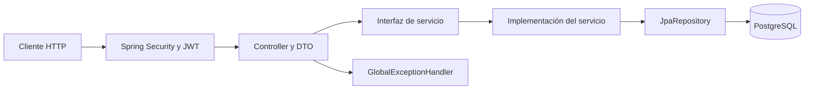

# Guía de estructura, reglas y creación de demoMO

Documento elaborado a partir del código y la configuración presentes en el proyecto. Describe lo implementado y distingue los puntos pendientes de las recomendaciones para ampliarlo. Las versiones indicadas son las declaradas en los archivos locales; no representan una comprobación de disponibilidad o compatibilidad externa.

## 1. Propósito y alcance

demoMO es una API REST con persistencia en PostgreSQL y autenticación mediante JWT. Implementa operaciones de creación, consulta, modificación y eliminación de invernaderos (`Greenhouse`) y cultivos (`Crop`), búsqueda de invernaderos por fecha y conteo de cultivos por invernadero.

También contiene entidades de proyectos, actividades y categorías, pero todavía no tienen repositorios, servicios, DTO ni controladores. Usuarios y roles sirven para autenticar y autorizar; no existe una API de registro o administración de usuarios.

## 2. Tecnologías y artefactos Maven

La fuente de las dependencias es [pom.xml](pom.xml).

| Elemento | Valor declarado o función |
| --- | --- |
| Lenguaje | Java 21 |
| Herramienta de construcción | Maven; el wrapper apunta a Maven 3.9.16 |
| Maven Wrapper | 3.3.4, distribución `only-script` |
| Parent | `org.springframework.boot:spring-boot-starter-parent:4.1.1` |
| Coordenadas del proyecto | `pe.edu.upc:demoMO:0.0.1-SNAPSHOT` |
| Paquete base | `pe.edu.upc.demomo` |
| Empaquetado | JAR, por defecto de Maven |
| Web | `spring-boot-starter-webmvc` |
| Persistencia | `spring-boot-starter-data-jpa` |
| Seguridad | `spring-boot-starter-security` |
| JWT / Resource Server | `spring-boot-starter-security-oauth2-resource-server` |
| OpenAPI / Swagger UI | `org.springdoc:springdoc-openapi-starter-webmvc-ui:3.1.0` |
| Conversión entre objetos | `org.modelmapper:modelmapper:3.2.6` |
| Driver | `org.postgresql:postgresql`, alcance `runtime` |
| Desarrollo | `spring-boot-devtools`, alcance `runtime`, opcional |
| Pruebas | `spring-boot-starter-data-jpa-test` y `spring-boot-starter-webmvc-test`, alcance `test` |
| Plugin de construcción | `spring-boot-maven-plugin` |

Las dependencias sin versión explícita heredan su gestión del parent. No se utiliza Lombok: los constructores, getters y setters están escritos en las clases.

## 3. Estructura de archivos

La raíz Maven es la carpeta que contiene `pom.xml`. En esta copia se encuentra dentro de la carpeta exterior `demoMO`.

```text
demoMO/                         # raíz Maven
├── pom.xml
├── mvnw / mvnw.cmd
├── .mvn/wrapper/maven-wrapper.properties
├── .gitignore
├── .gitattributes
├── HELP.md
├── GUIA_DEL_PROYECTO.md
├── src/main/java/pe/edu/upc/demomo/
│   ├── DemoMoApplication.java
│   ├── configs/                # ModelMapperConfig
│   ├── controllers/            # CropController, GreenhouseController, LoginController
│   ├── dtos/                   # contratos de entrada, salida y errores
│   ├── entities/               # las siete entidades JPA
│   ├── exceptions/             # excepción de recurso y manejador global
│   ├── repositories/           # acceso a cultivos, invernaderos y usuarios
│   ├── securities/             # configuración de seguridad, JWT y OpenAPI
│   ├── servicesinterfaces/     # ICropService, IGreenhouseService
│   └── servicesimplements/     # implementaciones y JwtUserDetailsService
├── src/main/resources/application.properties
├── src/test/java/pe/edu/upc/demomo/DemoMoApplicationTests.java
└── target/                     # salida generada de la construcción
```

`DemoMoApplication` contiene el método `main` y `@SpringBootApplication`. Las clases de la aplicación se colocan bajo el paquete base para participar en el descubrimiento de componentes y entidades.

`target/` y la configuración de IDE están excluidos por `.gitignore`. También está excluido `HELP.md`. `.gitattributes` define finales de línea LF para `mvnw` y CRLF para archivos `.cmd`. No se encontraron reglas `AGENTS.md`, formato automático, pipeline CI, Dockerfile ni migraciones versionadas en los archivos revisados.

## 4. Arquitectura y responsabilidad de cada capa



| Capa | Responsabilidad y convención observada |
| --- | --- |
| `entities` | Clases persistentes, tablas, columnas, claves y relaciones. |
| `dtos` | Representación JSON y restricciones de entrada; evita devolver directamente las entidades del CRUD. |
| `repositories` | Interfaces con prefijo `I`, anotadas con `@Repository`, que extienden `JpaRepository<Entidad, Long>`. |
| `servicesinterfaces` | Contratos con prefijo `I` y sufijo `Service`. |
| `servicesimplements` | Clases `@Service` que implementan los contratos y delegan en repositorios. |
| `controllers` | Rutas, permisos por método, validación, resolución de relaciones y respuestas HTTP. |
| `exceptions` | Traducción de excepciones concretas a respuestas de error. |
| `configs` y `securities` | Beans compartidos, autenticación, emisión/lectura de tokens y documentación. |

Las dependencias se inyectan por constructor y se guardan en campos `private final`. No se necesita `@Autowired` en los constructores únicos presentes. Los controladores dependen de interfaces de servicio. Los servicios actuales son delgados: varias verificaciones de existencia y la asociación entre cultivo e invernadero ocurren en los controladores.

Los métodos CRUD de servicio son `insert`, `list`, `update`, `delete` y `listId`. `insert` y `update` retornan `void` y usan `save`; `listId` devuelve `Optional`. No hay una frontera transaccional de servicio declarada mediante `@Transactional` en el código actual.

Los nombres de clases y propiedades son mayormente ingleses; varios métodos y mensajes son españoles. Existe la grafía particular `IGreenHouseRepository`, distinta de `IGreenhouseService`: conservar los nombres reales al referenciarlos.

## 5. Modelo de datos y restricciones

Todas las entidades usan identificadores `Long` con `@Id` y `@GeneratedValue(strategy = GenerationType.IDENTITY)`. Las longitudes y restricciones siguientes pertenecen al mapeo JPA; no equivalen por sí solas a validaciones de entrada HTTP.

| Entidad / tabla | Campos y restricciones declaradas |
| --- | --- |
| `Greenhouse` / `greenhouses` | `idGreenhouse`; `nameGreenhouse`: String(50); `capacityGreenhouse`: int; `dateInstallationGreenhouse`: LocalDate; `statusGreenhouse`: boolean; `temperatureGreenhouse`, `humidityGreenhouse`: float. Todos los campos de negocio tienen `nullable=false`. |
| `Crop` / `crops` | `idCrop`; `nameCrop`: String(50); `varietyCrop`: String(25); `dateSowingCrop`, `dateHarvestCrop`: LocalDate; `areaCrop`: double; `statusCrop`: boolean; `greenhouse`: relación obligatoria. Todos los campos de negocio tienen `nullable=false`. |
| `Project` / `projects` | `idProject`; `denominationProject`: String(30); `descriptionProject`: String(300); `modalityProject`: String(20); `dateProject`: LocalDate. Campos de negocio no nulos. |
| `Category` / `categories` | `idCategory`; `nameCategory`: String(25); `descriptionCategory`: String(200). Campos de negocio no nulos. |
| `Activity` / `activities` | `idActivity`; `nameActivity`: String(25); `quantityActivity`: int; `dateActivity`: LocalDate; `costActivity`: float. Estos campos son no nulos. Relaciones con `Project` y `Category` sin `nullable=false`. |
| `Users` / `users` | `id`; `username`: String(50), único y no nulo; `password`: String(200), no nulo; `enabled`: Boolean no nulo, inicializado en `true`; lista de roles. |
| `Role` / `roles` | `id`; `rol`: String(30), no nulo; usuario obligatorio por `user_id`; restricción única compuesta `(user_id, rol)`. |

Relaciones:

- `Crop → Greenhouse`: `@ManyToOne`, unión `idGreenhouse`, obligatoria, sin cascada declarada.
- `Activity → Project` y `Activity → Category`: `@ManyToOne`, uniones `idProject` e `idCategory`.
- `Role → Users`: `@ManyToOne(fetch = LAZY)`, unión `user_id`, obligatoria.
- `Users → Role`: `@OneToMany(mappedBy = "user", fetch = EAGER, cascade = ALL, orphanRemoval = true)`. La clave foránea la administra `Role.user`; al crear objetos asociados se deben mantener ambos lados de la relación.

El SQL nativo del proyecto utiliza columnas físicas en snake_case, como `id_crop`, `name_greenhouse` e `id_greenhouse`. Si se cambia la estrategia de nombres de Hibernate, se debe revisar esa consulta y el esquema resultante.

## 6. DTO, validaciones y reglas de negocio

| DTO | Contenido y reglas declaradas |
| --- | --- |
| `GreenhouseDTO` | Identificador y los campos del invernadero. Nombre `@NotBlank`; capacidad, temperatura y humedad `@Positive`; fecha `@NotNull`; estado boolean con `@NotNull`. |
| `CropDTO` | Identificador y campos del cultivo. Nombre y variedad `@NotBlank`; fechas `@NotNull`; área `@Positive`; estado boolean con `@NotNull`; `idGreenhouse` Long con `@NotNull`. La relación se expresa como identificador. |
| `CountDTO` | `nameGreenhouse` String y `quantityGreenhouse` Long; salida del conteo. |
| `LoginRequestDTO` | `username` y `password`, sin anotaciones de validación. |
| `LoginResponseDTO` | `token` y `username`. |
| `ErrorResponse` | `status` int, `message` String y `path` String. |

Reglas explícitas en los controladores:

1. Crear un cultivo exige que su invernadero exista; de lo contrario, se lanza `ResourceNotFoundException`.
2. Actualizar un cultivo verifica la existencia del cultivo y del invernadero, modifica el objeto existente y guarda la relación.
3. Actualizar un invernadero verifica su existencia y conserva su identificador.
4. Buscar por identificador o eliminar exige que el recurso exista.
5. Crear devuelve `201 Created` con cabecera `Location`; consultar y modificar, `200 OK`; eliminar, `204 No Content`.
6. Los `PUT` reciben el identificador en el cuerpo JSON, no en la URL.

`ModelMapperConfig` publica un `ModelMapper` sin reglas personalizadas. Los controladores lo usan para transformar DTO y entidades; para un cultivo, asignan explícitamente el `Greenhouse` recuperado de la base de datos. El mapeo de salida hacia `idGreenhouse` depende del mapeo implícito y debe comprobarse al modificar los modelos.

Límites actuales que no deben confundirse con reglas implementadas:

- `@NotNull` sobre un `boolean` primitivo no permite detectar su omisión: puede permanecer en `false`. Para distinguir ausencia se necesitaría `Boolean`.
- No hay `@Size` en los DTO para reproducir las longitudes JPA.
- No se valida que cosecha sea posterior a siembra, que humedad sea menor o igual a 100, ni que el área respete la capacidad del invernadero.
- Los identificadores de actualización no tienen validación explícita de obligatoriedad; un ID ausente no tiene una respuesta de validación diseñada.
- No se rechaza explícitamente un ID enviado en un `POST`. Para recrear una semántica estricta de creación habría que añadir esa regla.
- El POM no declara directamente `spring-boot-starter-validation`. Debe comprobarse la presencia de un proveedor de Bean Validation en las dependencias resueltas y el comportamiento efectivo de `@Valid`.

## 7. Catálogo de anotaciones utilizadas

| Anotación | Uso en este proyecto |
| --- | --- |
| `@SpringBootApplication` | Punto de arranque y configuración automática de la aplicación. |
| `@Configuration` | Clases que declaran configuración de Spring. |
| `@Bean` | Registro de ModelMapper, componentes de seguridad, JWT y OpenAPI. |
| `@Value("${jwt.secret}")` | Lectura del secreto JWT desde la configuración. |
| `@Entity` | Clase persistente administrada por JPA. |
| `@Table` | Nombre de tabla y restricciones únicas. |
| `@Id` | Clave primaria. |
| `@GeneratedValue` | Identificador generado con estrategia `IDENTITY`. |
| `@Column` | Nombre, longitud, nulabilidad y unicidad de columna. |
| `@ManyToOne` | Asociación de varias filas con una entidad relacionada. |
| `@OneToMany` | Colección de roles de un usuario. |
| `@JoinColumn` | Columna que guarda la clave foránea. |
| `@UniqueConstraint` | Unicidad de usuario y de la pareja usuario/rol. |
| `@Repository` | Componente de acceso a datos. |
| `@Query(..., nativeQuery = true)` | Consulta SQL de conteo de cultivos. |
| `@Service` | Implementaciones de servicios y servicios de autenticación/token. |
| `@RestController` | Controlador HTTP que devuelve cuerpos de respuesta. |
| `@RequestMapping` | Ruta base de un controlador. |
| `@GetMapping`, `@PostMapping`, `@PutMapping`, `@DeleteMapping` | Método HTTP y subruta de una operación. |
| `@RequestBody` | Deserialización del cuerpo JSON a un DTO. |
| `@PathVariable` | Lectura de `{id}` desde la URL. |
| `@RequestParam` | Lectura del parámetro `fecha`. |
| `@Valid` | Solicitud de validación del DTO de creación/actualización. |
| `@NotBlank` | Texto no nulo ni vacío o compuesto solo por espacios. |
| `@NotNull` | Valor de referencia obligatorio. |
| `@Positive` | Valor numérico estrictamente mayor que cero. |
| `@EnableMethodSecurity` | Activación de autorización por método. |
| `@PreAuthorize` | Expresión de roles exigida antes de ejecutar un método. |
| `@RestControllerAdvice` | Manejo compartido de excepciones de controladores. |
| `@ExceptionHandler` | Selección de la excepción tratada por un método. |
| `@Override` | Implementación de un método definido por una interfaz o superclase. |
| `@SpringBootTest` | Carga del contexto Spring en la prueba existente. |
| `@Test` | Identificación del método de prueba JUnit. |

Persistencia y validación usan imports `jakarta.persistence.*` y `jakarta.validation.*`. `javax.crypto` en JWT pertenece a criptografía de Java y no debe confundirse con los antiguos paquetes de persistencia.

## 8. Seguridad y ciclo del JWT

La fuente principal es [SecurityConfig.java](src/main/java/pe/edu/upc/demomo/securities/SecurityConfig.java).

1. El cliente envía `POST /login` con usuario y contraseña.
2. `AuthenticationManager` utiliza un `DaoAuthenticationProvider` y `JwtUserDetailsService`.
3. `IUsersRepository.findByUsername` consulta al usuario. `enabled` debe ser `true`; las contraseñas se comparan con `BCryptPasswordEncoder`.
4. Los valores de `Role.rol` se convierten directamente en autoridades de Spring Security.
5. `JwtTokenService` genera un JWT firmado con HS512, con `sub` (usuario), `iat`, `exp` y `roles` como texto separado por comas. Su vigencia está fijada en cinco horas.
6. El cliente envía `Authorization: Bearer <token>` en las solicitudes protegidas.
7. `JwtConfig` configura el codificador y decodificador; `CustomJwtAuthenticationConverter` convierte el claim `roles` en autoridades, quitando espacios e ignorando elementos vacíos.

Para satisfacer `hasRole('ADMIN')`, el valor almacenado debe ser `ROLE_ADMIN`. Análogamente: `ROLE_TESTER` y `ROLE_GUEST`. Ni el servicio de usuarios ni el convertidor añaden el prefijo.

La política de sesión es `STATELESS` y CSRF está desactivado. CORS está habilitado con configuración por defecto, pero no existe una lista explícita de orígenes permitidos. Permitir `OPTIONS` no garantiza por sí solo el acceso desde cualquier frontend.

`jwt.secret` se usa como bytes UTF-8 para una clave `HmacSHA512`; el código no lo decodifica como hexadecimal o Base64. No existen endpoints de renovación o revocación de tokens ni una implementación de cierre de sesión en el servidor.

## 9. Endpoints y permisos efectivos

Base local configurada: `http://localhost:8083`. “Autenticado” significa que se necesita JWT válido, sin rol adicional declarado para ese método.

| Método | Ruta | Acceso | Respuesta satisfactoria |
| --- | --- | --- | --- |
| POST | `/login` | Público | 200, token y usuario |
| GET | `/api/greenhouses` | ADMIN | 200, lista |
| POST | `/api/greenhouses` | ADMIN **y** GUEST simultáneamente | 201, DTO y Location |
| GET | `/api/greenhouses/{id}` | Autenticado | 200, DTO |
| PUT | `/api/greenhouses` | Autenticado | 200, DTO |
| DELETE | `/api/greenhouses/{id}` | Autenticado | 204 |
| GET | `/api/greenhouses/dates?fecha=2026-09-30` | Público | 200, lista |
| GET | `/apis/crops` | ADMIN **o** TESTER | 200, lista |
| POST | `/apis/crops` | Autenticado | 201, DTO y Location |
| GET | `/apis/crops/{id}` | ADMIN | 200, DTO |
| PUT | `/apis/crops` | Autenticado | 200, DTO |
| DELETE | `/apis/crops/{id}` | Autenticado | 204 |
| GET | `/apis/crops/count` | Autenticado | 200, lista de CountDTO |

Las rutas usan deliberadamente aquí la escritura real: `/api/greenhouses` y `/apis/crops`. No son intercambiables. La creación de invernaderos exige ambos roles porque la expresión utiliza `and`.

Las rutas de Swagger `/swagger-ui/**`, `/swagger-ui.html` y `/v3/api-docs/**` son públicas. `OpenApiConfig` define el título `Demo API`, versión `1.0` y esquema HTTP bearer `bearerAuth` como requisito global de documentación. Esa versión documental es distinta de la versión Maven. El requisito visual global no sustituye los permisos reales y puede aparecer también para operaciones públicas.

## 10. Consultas particulares

- `IGreenHouseRepository.findByDateInstallationGreenhouse(LocalDate)`: igualdad por fecha de instalación, expuesta mediante `/dates`.
- `ICropRepository.findByVarietyCrop(String)`: igualdad por variedad; existe en repositorio y servicio, pero no tiene endpoint.
- `IUsersRepository.findByUsername(String)`: devuelve `Optional<Users>` para autenticación.
- `ICropRepository.getTotalCropByGreenhouse()`: SQL nativo con `LEFT JOIN`, agrupa por identificador y nombre del invernadero, y cuenta `c.id_crop`. Incluye invernaderos sin cultivos con total cero. No define orden de resultados.

La consulta agregada devuelve `List<Object[]>`: posición 0 = nombre; posición 1 = conteo. `CropController` convierte el conteo mediante `((Number) item[1]).longValue()` y construye `CountDTO`. Cambiar el orden del SELECT obliga a adaptar esa conversión.

## 11. Respuestas de error

`GlobalExceptionHandler` trata únicamente estas excepciones:

| Excepción | HTTP | Cuerpo |
| --- | --- | --- |
| `ResourceNotFoundException` | 404 | `ErrorResponse` con el mensaje y la ruta. |
| `MethodArgumentNotValidException` | 400 | `ErrorResponse` con el primer error de campo encontrado. |

Ejemplo del formato:

```json
{
  "status": 404,
  "message": "No existe un cultivo con el id: 99",
  "path": "/apis/crops/99"
}
```

Los rechazos de autenticación/autorización y otros errores (JSON mal formado, integridad de base de datos, parámetros inválidos) no tienen aquí un manejador personalizado equivalente. No se debe asumir que todos devuelven `ErrorResponse`. La eliminación de un invernadero con cultivos no tiene una regla previa ni borrado en cascada declarado y puede fallar por integridad referencial.

## 12. Configuración del entorno

La configuración reside en [application.properties](src/main/resources/application.properties).

| Propiedad | Configuración actual / significado |
| --- | --- |
| `spring.application.name` | `demoMO` |
| `spring.jpa.database` | `postgresql` |
| `spring.jpa.show-sql` | `true`, muestra SQL |
| `spring.jpa.hibernate.ddl-auto` | `update`, actualiza el esquema a partir de entidades |
| `spring.datasource.driver-class-name` | `org.postgresql.Driver` |
| `spring.datasource.url` | `jdbc:postgresql://localhost/BDMOSEC` |
| `spring.datasource.username` | Usuario local configurado: `postgres` |
| `spring.datasource.password` | Contraseña definida en el archivo; no se reproduce en esta guía |
| `server.port` | `8083` |
| `jwt.secret` | Secreto definido en el archivo; no se reproduce en esta guía |

No hay perfiles separados ni archivos de migración o datos iniciales. `ddl-auto=update` no crea la base de datos PostgreSQL ni proporciona usuarios iniciales.

Para una instalación nueva se pueden sobrescribir los valores mediante variables de entorno en la misma sesión de PowerShell:

```powershell
$env:SPRING_DATASOURCE_URL = 'jdbc:postgresql://localhost:5432/BDMOSEC'
$env:SPRING_DATASOURCE_USERNAME = 'postgres'
$env:SPRING_DATASOURCE_PASSWORD = '<contraseña de tu base de datos>'
$env:JWT_SECRET = '<secreto propio para HS512, de al menos 64 bytes>'
$env:SERVER_PORT = '8083'
```

Sustituir los marcadores antes de ejecutar. Estas variables afectan solo a la sesión y sus procesos hijos; no modifican `application.properties`.

## 13. Cómo recrear y ejecutar el proyecto

### Paso 1: preparar las herramientas

Instalar/configurar JDK 21 y un servidor PostgreSQL accesible. El repositorio no fija una versión de PostgreSQL. Configurar `JAVA_HOME` para el JDK. Se necesita acceso a los repositorios Maven para la primera descarga de dependencias y del wrapper.

Abrir en el IDE la carpeta que contiene `pom.xml` e importarla como proyecto Maven. Desde la carpeta exterior de esta copia:

```powershell
Set-Location .\demoMO
java -version
.\mvnw.cmd -v
```

### Paso 2: crear la base de datos

Conectarse a PostgreSQL con una cuenta autorizada y ejecutar:

```sql
CREATE DATABASE "BDMOSEC";
```

Mantener ese nombre en la URL JDBC y proporcionar credenciales válidas. Las tablas se gestionan al iniciar la aplicación con `ddl-auto=update`.

### Paso 3: construir los artefactos en orden

Para crear un proyecto equivalente desde cero:

1. Crear un proyecto Maven Java 21 con las coordenadas y dependencias del apartado 2; usar el `pom.xml` local como referencia exacta.
2. Crear `DemoMoApplication` en `pe.edu.upc.demomo`.
3. Crear las siete entidades y sus relaciones, constructores y accesores.
4. Crear los DTO y sus restricciones; comprobar la disponibilidad del proveedor de validación.
5. Crear los tres repositorios y sus consultas.
6. Crear las interfaces de servicios y sus implementaciones con inyección por constructor.
7. Registrar ModelMapper y crear la excepción y el manejador global.
8. Crear los controladores, sus rutas, respuestas y comprobaciones de existencia.
9. Configurar usuarios, BCrypt, autenticación, clave JWT, codificador/decodificador, convertidor de autoridades y reglas de seguridad.
10. Añadir OpenAPI y la configuración de conexión/puerto.
11. Crear la prueba de carga de contexto y verificar el flujo completo con datos locales.

### Paso 4: compilar y arrancar

Desde la raíz Maven, ejecutar los comandos por separado según el objetivo:

```powershell
# Compilar sin arrancar la aplicación
.\mvnw.cmd compile

# Ejecutar en desarrollo; detener con Ctrl+C
.\mvnw.cmd spring-boot:run

# Ejecutar las pruebas existentes; requieren el entorno de aplicación
.\mvnw.cmd test

# Empaquetar, incluyendo las pruebas
.\mvnw.cmd package

# Ejecutar el JAR después de empaquetar
java -jar .\target\demoMO-0.0.1-SNAPSHOT.jar
```

No iniciar simultáneamente el JAR y `spring-boot:run` en el mismo puerto. En Linux/macOS, utilizar `./mvnw` en lugar de `.\mvnw.cmd`.

### Paso 5: preparar el primer usuario

No hay credenciales funcionales ni usuarios semilla garantizados por el código. Antes de probar `/login`, crear un usuario habilitado en `users`, con la contraseña codificada mediante `BCryptPasswordEncoder`, y sus filas relacionadas en `roles`.

Este es un ejemplo de lógica para una carga inicial local que habría que implementar; no existe como inicializador en el proyecto:

```java
Users user = new Users();
user.setUsername("admin_local");
user.setPassword(passwordEncoder.encode(passwordLocal));
user.setEnabled(true);

for (String name : java.util.List.of("ROLE_ADMIN", "ROLE_GUEST")) {
    Role role = new Role();
    role.setRol(name);
    role.setUser(user);
    user.getRoles().add(role);
}

usersRepository.save(user);
```

`passwordEncoder` e `usersRepository` deben ser componentes inyectados y `passwordLocal` una contraseña elegida para el entorno. Comprobar previamente que el usuario no exista para evitar duplicados. Los dos roles del ejemplo permiten probar la creación de invernaderos según su regla actual.

### Paso 6: probar el flujo HTTP

Abrir `http://localhost:8083/swagger-ui/index.html`; el documento OpenAPI está en `http://localhost:8083/v3/api-docs`. Iniciar sesión:

```http
POST /login
Content-Type: application/json

{"username":"admin_local","password":"<contraseña elegida>"}
```

Tomar `token` de la respuesta y enviarlo como Bearer. Crear primero un invernadero:

```http
POST /api/greenhouses
Authorization: Bearer <token>
Content-Type: application/json

{
  "nameGreenhouse": "Invernadero Norte",
  "capacityGreenhouse": 100,
  "dateInstallationGreenhouse": "2026-09-30",
  "statusGreenhouse": true,
  "temperatureGreenhouse": 24.5,
  "humidityGreenhouse": 65.0
}
```

Usar el identificador devuelto para crear el cultivo (el `1` siguiente es solo un ejemplo):

```http
POST /apis/crops
Authorization: Bearer <token>
Content-Type: application/json

{
  "nameCrop": "Tomate",
  "varietyCrop": "Cherry",
  "dateSowingCrop": "2026-09-30",
  "dateHarvestCrop": "2026-12-15",
  "areaCrop": 20.5,
  "statusCrop": true,
  "idGreenhouse": 1
}
```

Consultar después `/apis/crops/count`. Para actualizar, enviar el JSON completo al `PUT` correspondiente e incluir `idCrop` o `idGreenhouse`. Para eliminar los datos del ejemplo, eliminar primero el cultivo y luego el invernadero.

## 14. Patrón para agregar un módulo

Para ampliar el proyecto manteniendo su estructura:

1. Definir una entidad en `entities`, tabla, ID y relaciones.
2. Definir su DTO en `dtos`; usar identificadores para referencias a otras entidades y especificar las restricciones de entrada.
3. Crear `I<Entidad>Repository extends JpaRepository<Entidad, Long>`.
4. Crear `I<Entidad>Service` y `<Entidad>ServiceImplement` con `@Service`.
5. Crear `<Entidad>Controller`, inyectar servicio y ModelMapper, y declarar una ruta base explícita.
6. Aplicar `@Valid` a entradas y comprobar existencia antes de modificar, eliminar o asociar recursos.
7. Mantener la convención de respuestas 200/201/204/404 y decidir explícitamente los permisos. En la configuración actual, omitir `@PreAuthorize` deja la operación disponible a cualquier usuario autenticado, salvo excepciones de la cadena de seguridad.
8. Si se añade una consulta agregada, definir el DTO de salida y comprobar el orden y tipos de columnas.
9. Actualizar esta guía y verificar que OpenAPI describa el nuevo contrato.

Como mejoras futuras, separar las reglas de negocio en servicios, definir transacciones para operaciones compuestas, utilizar migraciones versionadas y completar las pruebas de autorización, validación e integridad. Estas mejoras no están implementadas por la creación de este documento.

## 15. Verificación y límites de esta guía

La única prueba encontrada es `DemoMoApplicationTests.contextLoads()`, anotada con `@SpringBootTest`. No contiene aserciones de negocio y carga el contexto con la configuración disponible; no se encontró un perfil de prueba con base de datos aislada.

Para verificar una recreación, comprobar: arranque y conexión a PostgreSQL; login con usuario habilitado; denegación por falta de roles; CRUD de ambos recursos; errores por recursos inexistentes y DTO inválidos; asociación de cultivo con invernadero; conteo incluyendo un invernadero sin cultivos; y consulta pública por fecha.

Este documento se contrastó mediante lectura estática del código, DTO, anotaciones, consultas, POM y configuración. No se ejecutaron la aplicación, la compilación ni las pruebas al elaborarlo; por tanto, no certifica su funcionamiento en este equipo.

Fuentes locales principales: [código Java](src/main/java/pe/edu/upc/demomo), [configuración](src/main/resources/application.properties), [POM](pom.xml), [wrapper](.mvn/wrapper/maven-wrapper.properties) y [prueba existente](src/test/java/pe/edu/upc/demomo/DemoMoApplicationTests.java).
